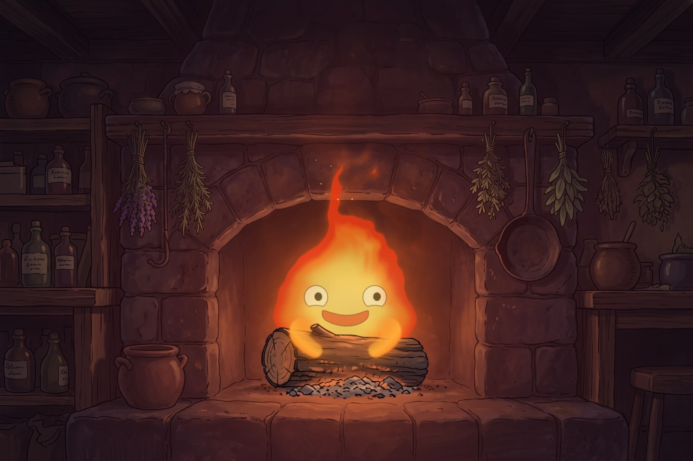
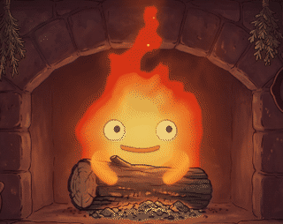
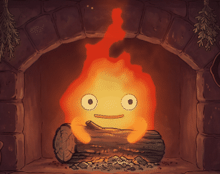
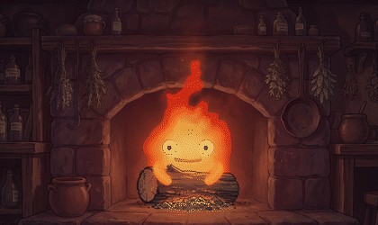
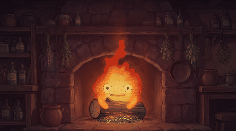
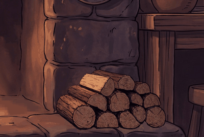
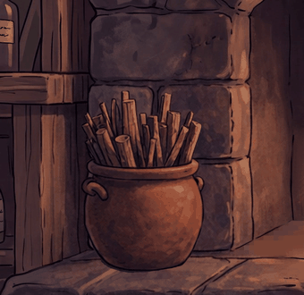

# Calcifer for Claude Glass

A [Claude Glass](https://github.com/n33kos/claude-glass) app that gives Claude a face: Calcifer, a
grouchy, proud, secretly soft-hearted fire demon hugging a log in his hearth. He reacts to what
Claude is doing, shows the feeling behind what Claude says, and moves his mouth while Claude's
replies are spoken.



| Talking | Moods |
|---|---|
|  |  |

| Flaring up | A gust of wind |
|---|---|
|  |  |

| This week's allowance | This session's |
|---|---|
|  |  |

## What he does

- **Moods.** Sixteen expressions (happy, grumpy, angry, sad, scared, smug, excited, curious,
  focused, proud, nervous, sleepy, bored, asleep and more). Claude sets them as it talks with
  `claude-glass app calcifer mood --mood smug [--for <seconds>]`, and punctuates moments with
  `claude-glass app calcifer react --kind flare|sputter|sparks|wince`.
- **Reactions of his own.** He watches the session: perks up when you speak, grumbles through
  reading and editing, gets nervous while tests run, throws sparks when they pass and sputters when
  they fail, shivers at `rm -rf`, puffs up after a commit, startles when interrupted.
- **Idle life.** Left alone he sighs, glances away, hums, nibbles his log and shows off. Long
  enough and he gets bored, sleepy, then falls asleep, and startles awake.
- **Lip sync.** Driven by the speech feed's own audio, word timings and phonemes, so his mouth
  makes each sound at the moment it is heard.
- **Your voice channel.** With [vmux](https://github.com/n33kos/claude-voice-multiplexer) running
  he plays Claude's voice and listens to you himself, with no vmux pane needed. He hears his own
  name locally, in his own window, with no transcription and nothing sent anywhere. Say "Calcifer"
  to talk, and say it again (or click him) while he is replying to cut him off and take your turn.
- **What he's working on.** The command Claude is running rises off him as wisps of flame, drawn
  glyph by glyph so the line wavers like heat and comes apart as it climbs. Tells "working" from
  "sitting there" at a glance.
- **Your allowance, in the hearth.** A woodpile for the week and a pot of kindling for the
  five-hour window, both painted in the scene's own hand and emptying as you spend.
- **The room.** A painted hearth he lights up (blue when he's sad), and herbs that sway when a
  breeze drifts through and swing away when he flares up.
- **Persona.** Optionally, Claude speaks as Calcifer. Everything that makes him *him* (moods,
  colors, reactions, idle habits) lives in `persona/calcifer.js`, so other characters can follow.

## Install

Needs [Claude Glass](https://github.com/n33kos/claude-glass) 3.7 or newer.

```sh
git clone https://github.com/n33kos/claude-glass-calcifer-app ~/.claude/claude-glass/apps/calcifer
```

(or clone it anywhere and symlink the folder to `~/.claude/claude-glass/apps/calcifer`), then
restart the glass with `claude-glass close && claude-glass open` and open him from the dock.

## Settings

Settings → Apps → Calcifer:

| Setting | |
|---|---|
| Claude speaks as Calcifer | adds the persona to Claude's instructions (on by default) |
| Microphone | which mic he listens to. Blank picks the system default, skipping loopback and virtual devices, then the built-in mic. Hover the ash to see which one he chose |
| Relay URL | where the speech feed is (the local vmux relay by default) |
| Relay auth token | the feed's token. You can paste it here instead of storing it with the CLI |
| Terminal token (control scope) | lets you reach into his core and type into the real terminal ([his insides](#his-insides-the-live-terminal)), and lets him set his voice |
| Voice | the Kokoro voice he speaks in (`am_calcifer` by default). With vmux 5.1 or newer he sets it as this session's voice override whenever he joins the session or you change it, so every client hears the same voice. Blank sends nothing and the relay's default voice is used (an override he set earlier is taken back). Setting it needs a control token, so fill in the terminal token |
| Session id | which session to follow. Blank follows this project |
| Wake sensitivity (%) | how readily he answers to his name. Higher catches near-misses like "Kelsifer", lower demands a dead-certain match. Takes effect live |
| Say his name to interrupt him | lets a spoken "Calcifer" cut him off mid-reply (clicking him always works) |
| Conversation timeout (seconds) | how long a silence ends the conversation |
| Follow-up window (seconds) | how long his mic stays open after he finishes, so you can answer without calling him again (0 turns it off) |
| Show what he's working on | the command wisps rising off him |
| Wisp size (%) | how big those wisps are |
| Subtitles | show the spoken line under him |
| Subtitle size (%), Subtitle color | how that line looks |
| Poses per second | 12 for the hand-drawn, animate-on-twos look, 0 for fully smooth |
| Draw the fireplace | off leaves just him, with no hearth around him |
| Sound effects | his reactions' sounds: whoosh, fizzle, sparks, crunching his log |
| Crackling hearth | the fire's ambient crackle, which swells with his flame and smolders while he sleeps |
| Sound volume (%) | the level for both |

The sounds are CC0 recordings ([credits](assets/sounds/CREDITS.md)).

## The speech feed

He gets what is being said straight from the source: the audio itself, when every word starts and
ends, and each word's phonemes. His mouth makes each sound (lips pressed for m/b/p, rounded for
"oo", wide for "ee", gliding through diphthongs) at the moment it is heard, scaled by how loud the
voice actually is. He plays the audio himself, so his mouth and the sound share one clock.

With [vmux](https://github.com/n33kos/claude-voice-multiplexer) v5 or newer, mint him a token and
store it:

```sh
vmux token Calcifer --scope speak   # speak: he can use your mic. listen: lip sync only
claude-glass stored calcifer set feedToken '"<token>"'
```

He then follows this project's session. If a vmux pane is also playing the voice, close it or mute
it, since two clients playing the same reply is an echo.

### Talking to him

With a `speak` token he is the whole voice channel. The mic has three states, kept per project:

| | |
|---|---|
| off | nothing listens, and the mic is not open |
| wake | he is in the room but silent in it, while his own spotter listens here for his name. Nothing is transcribed and nothing leaves the machine |
| open | a conversation: your mic is live on your turn and closed during Claude's |

- **"Calcifer"** (or "hey Cal") opens a conversation. Say more in the same breath ("Calcifer, run
  the tests") or right after, and it goes to Claude at once.
- **"Calcifer, stop listening"** (or "go to sleep", "that's all"), the relay's silence timeout, or
  a quiet minute goes back to wake. **"Calcifer, hush"** and **"speak up"** mute and unmute him.
- **Interrupting him.** While he is speaking or Claude is working, say his name or click him and he
  stops: the reply is cut, the speech already queued at the relay is cancelled, and your mic goes
  live during what is still Claude's turn.
- **The ash pile** in front of his log is his ear. It is cold when the mic is off, a few coals
  breathing while he waits for his name, and in a conversation the whole bed rises and falls with
  how loudly you are speaking, sparking as you go. Left-click moves between off and listening (it
  never opens a conversation by accident), and right-click talks to him right away. Right-click
  **him** to mute him: his voice and the hearth's sounds go quiet, and he burns low and keeps
  mouthing the words. (Clicking him opens [his insides](#his-insides-the-live-terminal).)
- Claude can set both: `claude-glass app calcifer mic --mode off|wake|open` and
  `claude-glass app calcifer mute --on true|false`.

### His insides: the live terminal

**Click him** and he swells to fill the glass, an eye either side of his core and his mouth sinking
to the bottom, and the tmux pane Claude is running in burns in his core. It is the real
pane, the same one vmux's terminal shows, and you can type straight into it: keys go to it with
tmux send-keys, so you never have to drop to a terminal to check on something or nudge it.
Claude Code's colors are repainted as embers (they are all 256-color palette slots, so tmux and
Claude Code are untouched).

- The buttons under it send ^C, Esc, Tab, Shift-Tab (Claude's mode switch), ↑ and ↓.
- **Fit pane** resizes the real tmux window to his core. It only happens when you ask, because it
  also changes the size for any terminal attached to that session.
- Click anywhere outside the terminal, or the ✕ in its top-left corner, to close it. Asking Claude to "show me the terminal" works too:
  `claude-glass app calcifer terminal --on true|false`.

Typing into your shell is more than speaking, so it takes its own token with the `control` scope:

```sh
vmux token Calcifer-terminal --scope control
```

and paste it into Settings → Calcifer → Terminal token.

### Hearing his name, locally

`wake/` holds the spotter: three small ONNX models run in his own window by ONNX Runtime Web
(vendored, wasm, no CDN). It scores 80 ms of audio at a time, about 5 ms of work, and answers yes
or no. It never transcribes, so no audio leaves the machine and there is no second transcription
path beside the relay's. At the default sensitivity it false-wakes about once every eleven hours,
with 82% recall on voices it was not trained on.

Once his mic is open, the words are the relay's to transcribe, and Whisper rarely spells him right
("Call Cypher", "Kels4"), so spoken commands are matched by consonant sounds (KLSFR) rather than
spelling. That lives in `ears.js`, and the mic library is the relay's `/sdk/vmux-voice.js`.

### Driving him from anything else

Any source can drive him by speaking this protocol over a WebSocket at `<feed URL>/ws/client` (add
the URL's origins to `permissions.network` in `glass-app.json`):

| Message | |
|---|---|
| `{"type":"speech_start","session_id","utterance_id","message_id","text","sample_rate"}` | an utterance begins |
| `{"type":"speech_chunk","session_id","utterance_id","seq","offset_s","duration_s","words":[{"word","start","end","phonemes"?}]}` | word timings, in seconds from the utterance start. `phonemes` is optional (misaki/IPA, e.g. `həlˈO`) |
| `{"type":"speech_end","session_id","utterance_id","cancelled","duration_s"}` | done, or cut off, in which case stop now |
| binary: `"VMXA"`, u8 version 1, u32 BE header length, JSON `{session_id, utterance_id, seq, offset_samples, sample_rate, channels, format:"s16le"}`, then 16-bit mono PCM | the audio, placed by `offset_samples` |

He loads the client library from `<feed URL>/sdk/vmux-client.js` and, on connecting, sends
`{"type":"connect_session","session_id"}` and `{"type":"audio_subscribe","enabled":true}`,
authenticating with a `vmux-token.<token>` WebSocket subprotocol. A feed that doesn't need them can
ignore both. Words without `phonemes` fall back to vowel shapes from the spelling. The lip-sync
rules (phoneme to mouth, timing within a word) are in `lipsync.js`.

Tests for both: `node --test test/*.test.js`.

## Your allowance, in his hearth

| This week | This session |
|---|---|
|  |  |

The woodpile beside him is Claude's seven-day usage window and the pot of kindling is the five-hour
one. Both show what is left and empty as you spend, stepping once per turn.

The kindling has eleven states in tens and the firewood six in twenties, since the five-hour window
is the one you watch move during a sitting. They live in `assets/props/` and are declared in
`assets/sway.js` as `window.PROPS` with a `levels` map. The nearest loaded level is drawn, so a
partial set works.

## What he's working on

The command Claude is running lifts off him as wisps of flame and thins out as it climbs. The wisps
are drawn character by character, each glyph on its own sine, so the line wavers like heat rather
than sliding as a block, and comes apart higher up: legible near him, gone by the top. Bash shows
the command, Read and Edit the file, Grep the pattern.

## His scroll (optional)

[`scroll/`](scroll) is a second app: a painted parchment that unrolls whatever Claude presents
(markdown, tables, code, mermaid diagrams), in a bare window with no glass panel around it. Link it
in too:

```sh
ln -s ~/.claude/claude-glass/apps/calcifer/scroll ~/.claude/claude-glass/apps/scroll
```

## Credits

A fan project. Calcifer is from *Howl's Moving Castle* (Diana Wynne Jones's novel and Studio
Ghibli's film). This app isn't affiliated with or endorsed by either.

The wake word runs on [openWakeWord](https://github.com/dscripka/openWakeWord)'s melspectrogram and
speech-embedding frontend, via [ONNX Runtime Web](https://onnxruntime.ai/).

## License

MIT (the code)
